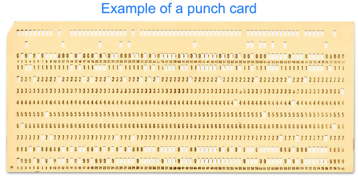
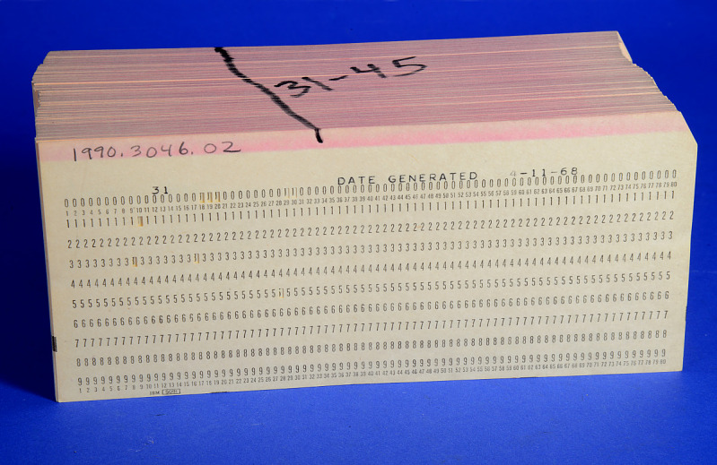

# Linguagem de programação

Existem muitas linguagens de programação. Na verdade elas são incontáveis. Podemos
imaginar que surgiram pelas mãos de Ada Lovelace, quando ela escreveu o primeiro programa utilizando uma sequência de instruções. A partir daí tivemos programas escritos em linguagem de máquina (utilizando 0s e 1s) utilizando cartões perfurados (coisa que fazemos hoje via VS Code).

É possível dividir as linguagens de programação em duas principais categorias:
- Linguagem de baixo nível
- Linguagem de alto nível

## Linguagem de baixo nível

Essas são linguagens pouco ou quase nada utilizadas por programadores (na atualidade). _Assembly_ é um exemplo,
ela é mais próxima da linguagem que o computador reconhece. Através dela é possível escrever programas super
performáticos quando utilizamos.

> Tudo na vida é uma questão de escolha

Essa afirmação também é verdade quando falamos em programação. Escrever um programa em uma linguagem de baixo
nível é muito trabalhoso.

## Linguagem de alto nível

A maioria das linguagens se encaixam nessa categoria. Elas são ditas de alto nível porque se aproximam do idioma
escrito. Escrever e ler programas se torna mais fácil. O programador passa a ter centralidade porque um dos
objetos dessas linguagens é habilitar qualquer pessoa a escrever código.

**Cartão perfurado**

**Exemplo de um programa escrito em vários cartões perfurados**

## Links

- [História das linguagens de programação](https://pt.wikipedia.org/wiki/Hist%C3%B3ria_das_linguagens_de_programa%C3%A7%C3%A3o)