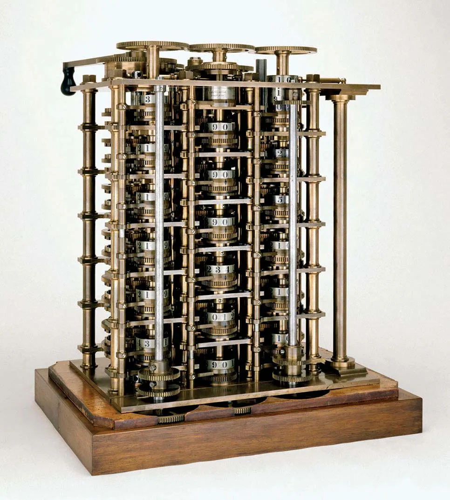
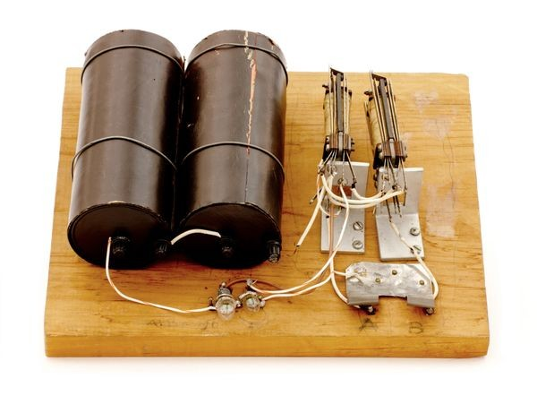

# Por que programamos?

Essa é uma pergunta que parece simples mas não é. Há muita história do porque fazemos o que fazemos, como tudo começou e porque continuamos a programar. Que tal conhecermos um pouco a história dos nossos predecessores?

Tudo começou quando [Charles Babbage](https://pt.wikipedia.org/wiki/Charles_Babbage), por volta de 1820, projetou uma calculadora mecanizada capaz de realizar operações _simples_ de aritmética. Contudo Babbage não conseguiu concluir sua máquina. Até que por volta de 1830 Charles projetou uma nova geringonça, dessa vez chamada de Máquina Analítica.

Sua segunda invenção consistia em um total aperfeiçoamento da calculadora mecanizada. Dessa vez, tal equipamento seria capaz de realizar qualquer operação aritmética. A ideia consistia em a máquina consumisse as instruções via cartões perfurados, utilizasse uma unidade de memória para armazenar-las e que também houvesse controles de sequência. Essas especificações eram muito complexas quando comparadas com qualquer máquina já mais construídas até então. Tal instrumento nunca foi construído.

Até que em 1843, [**Ada Lovelace**](https://pt.wikipedia.org/wiki/Ada_Lovelace) traduziu as especificações da máquina analítica. Em seguida ela publicou o que foi considerado o **primeiro programa da história**. Utilizando as especificações de Babbage, Ada idealizou uma sequência de instruções capaz de realizar cálculos e entregar os seus resultados.

Vale ressaltar que as máquinas que Babbage imaginou eram operadas via catracas, polias, engrenagens, manivelas. Todos os componentes eram físicos, estes eram responsáveis por orquestrar a leitura das instruções e suas execuções (veja as fotos das máquinas).

O segundo salto inovativo na área da computação foi a utilização da programação binária para escrever e interpretar instruções computacionais. Tal avanço foi possível porque em [Gottfried Wilhelm Leibniz](https://en.wikipedia.org/wiki/Gottfried_Wilhelm_Leibniz) idealizou a computação binária por volta de 1670.

O sistema numérico binário consiste em representar os números utilizando apenas duas possibilidades (0 ou 1). Por exemplo, podemos representar os seguintes números utilizando o sistema binário:
- `1` é igual a `01`
- `2` é igual a `10`
- `3` é igual a `11`
- `4` é igual a `100`
- `100` é igual a `1100100`

Você deve ler o código binário da direita pra esquerda. O número `1` significa que aquele `bit` *naquela posição* está ativo e o número `0` significa que aquele `bit` *naquela posição* está inativo.

A utilização do sistema numérico binário foi revolucionária porque a partir desse ponto foi possível utilizar eletricidade para representar o estado (LIGADO ou DESLIGADO, 1 ou 0). Assim [George Robert Stibitz](https://en.wikipedia.org/wiki/George_Stibitz) criou um circuíto digital capaz de realizar somas utilizando releres.

Mas foi outro matemático quem inventou a `lógica binária`, o que vem a ser a base da computação moderna. [George Boole](https://en.wikipedia.org/wiki/George_Boole), ele entendeu que os estados `Verdadeiro` e `Falso` também poderiam ser representados como `1` e `0`.

A partir do trabalho de Stibitz e de Boole, máquinas mais avançadas foram criadas e evoluíram até o que temos hoje em dia.

Então nós programamos porque pessoas muito inteligentes trabalharam durante séculos até que fosse possível a invenção de uma máquina capaz de receber instruções a partir de uma entrada e exibir o resultado em uma interface de saída. A crescente informatização do mundo requer que mais e mais programas sejam idealizados, criados e mantidos durante anos ou até mesmo décadas.

**Máquina diferencial**

**Máquina analítica**

**Máquina de soma utilizando releres**

## Links externos
1. [Sistema binário](https://www.alura.com.br/artigos/sistema-codigo-binario)